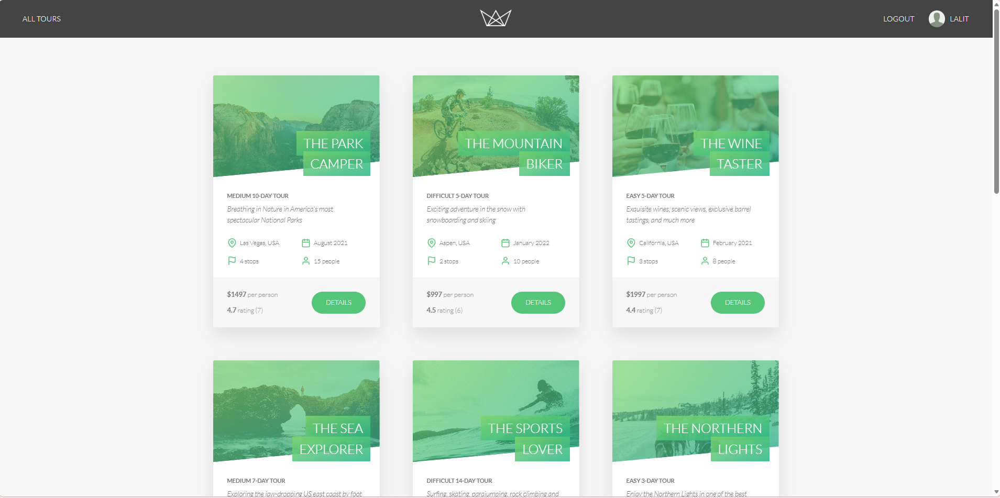
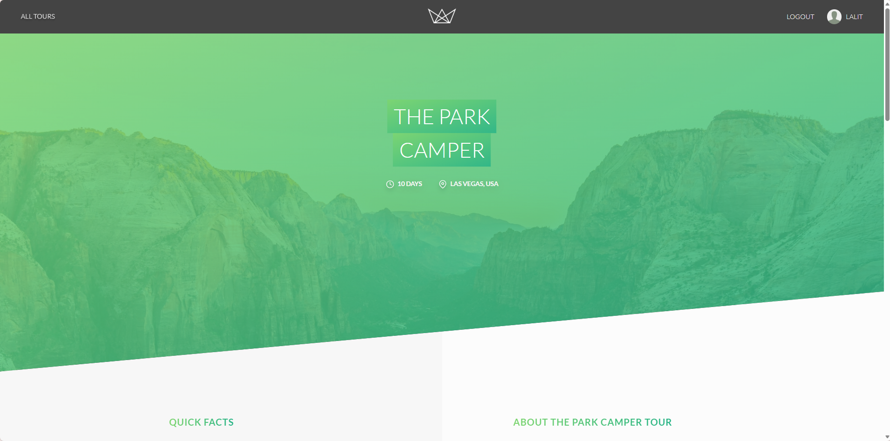
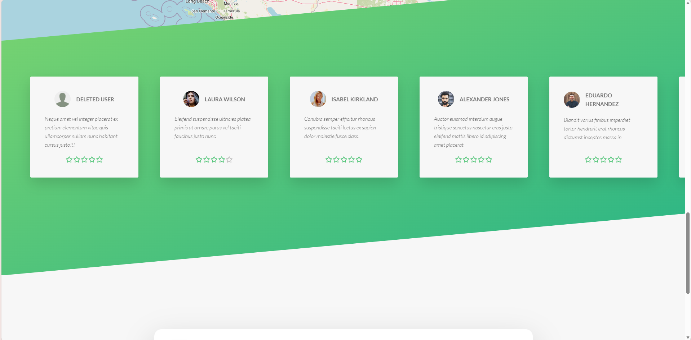
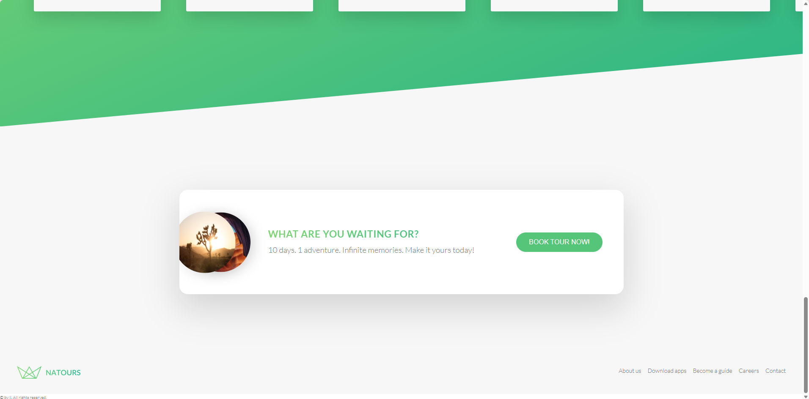
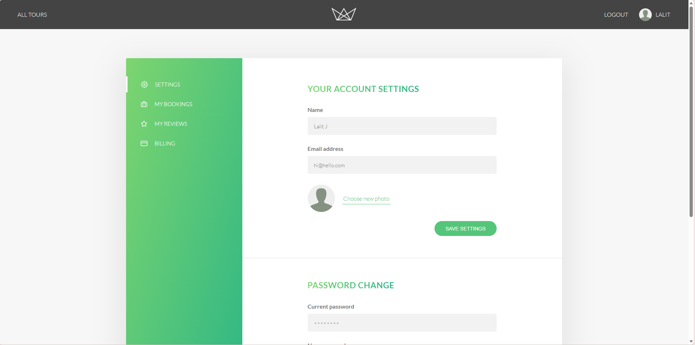
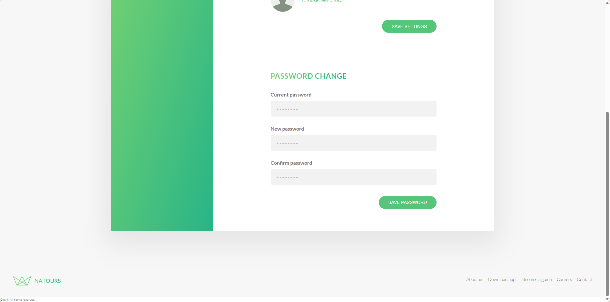

# Natours - Exciting tours for adventurous people


Natours is a comprehensive tour booking application built with a Node.js and Express backend. It provides a RESTful API for managing tours, users, and reviews, along with a server-side rendered website using Pug templates. The application includes features like user authentication, payment processing with Stripe, geospatial tour searching, and automatic email notifications.

## Screenshots

### Tour Listings
The home page displays all available tours as cards, each showing the tour name, difficulty level, duration, starting location, next date, number of stops, group size, price per person, and average rating.



### Tour Detail Page
Clicking a tour opens a full detail page with:
- **Hero section** — full-width banner image overlaid with the tour name, duration, and starting location
- **Quick Facts** — next available date, difficulty, number of participants, and rating
- **Tour Guides** — lead guide and tour guide profiles
- **About section** — a narrative description of the tour
- **Photo gallery** — three landscape images showcasing tour destinations
- **Interactive map** — Mapbox map with pins for each tour stop
- **Reviews** — horizontally scrollable user review cards with star ratings
- **Booking CTA** — a call-to-action card with a *Book Tour Now!* button that initiates the Stripe checkout flow







### User Account
Authenticated users can access their account dashboard, which includes:
- **Settings** — update display name, email address, and profile photo
- **Password Change** — update password by providing the current password and a new one
- **My Bookings** — view booked tours
- **My Reviews** — manage submitted reviews
- **Billing** — payment information




---

## Features

- **RESTful API** — complete API for tours, users, reviews, and bookings
- **Server-Side Rendering** — user-facing website built with Pug templates
- **Authentication** — secure user authentication using JWT, including sign-up, login, password reset, and secure cookies
- **Authorization** — role-based access control for users, guides, lead-guides, and admins
- **Payment Integration** — seamless tour booking and payment processing powered by Stripe Checkout
- **Geospatial Analysis** — find tours within a specific radius and calculate distances to all tours from a given point; tour stops displayed on an embedded Mapbox map
- **Image Uploads** — users can upload profile photos; admins can upload tour images, with on-the-fly processing and resizing using `sharp`
- **Email Notifications** — automated welcome and password-reset emails using `nodemailer` and `SendGrid` for production
- **Advanced API Features** — filtering, sorting, field limiting, and pagination for all major resources
- **Security Best Practices** — rate limiting, security HTTP headers with `helmet`, parameter pollution prevention with `hpp`, and data sanitization against NoSQL injection and XSS attacks
- **Containerization** — ready to deploy with provided `Dockerfile` and `docker-compose.yaml` configurations

---

## Tech Stack

- **Backend** — Node.js, Express.js
- **Database** — MongoDB with Mongoose ODM
- **Templating** — Pug
- **Authentication** — JSON Web Tokens (JWT), bcrypt
- **Payments** — Stripe
- **Maps** — Mapbox
- **Image Processing** — Multer, Sharp
- **Email** — Nodemailer, SendGrid, Pug
- **Dev Tools** — ESLint, Prettier, Nodemon
- **Containerization** — Docker

---

## Getting Started

### Prerequisites

- Node.js (v22 or later)
- MongoDB (local instance or a cloud service like MongoDB Atlas)
- NPM

### Installation and Setup

1. **Clone the repository:**
   ```sh
   git clone https://github.com/lj-unicorn/Natours.git
   cd Natours
   ```

2. **Install dependencies:**
   ```sh
   npm install
   ```

3. **Set up environment variables:**
   Create a `config.env` file in the root directory by copying the example file.
   ```sh
   cp .env.example config.env
   ```
   Fill in the required values. See the [Environment Variables](#environment-variables) section for details.

4. **Import development data (optional):**
   Populate the database with sample tours, users, and reviews.
   ```sh
   # Import data
   node dev-data/data/import-dev-data.js --import

   # Delete data
   node dev-data/data/import-dev-data.js --delete
   ```

### Running the Application

```sh
# Development (with hot-reloading)
npm run dev

# Production
npm start
```

The application will be available at `http://localhost:3000`.

### Running with Docker

1. Ensure you have a `config.env` file with the necessary variables.
2. Run:
   ```sh
   docker compose up --build
   ```

The application will be available at `http://localhost:3000`.

---

## Environment Variables

Provide the following in your `config.env` file:

| Variable | Description |
|---|---|
| `PORT` | Port the application runs on (e.g. `3000`) |
| `NODE_ENV` | `development` or `production` |
| `DATABASE` | MongoDB connection string (replace `<PASSWORD>`) |
| `DATABASE_PASSWORD` | Your MongoDB password |
| `JWT_SECRET` | Secret string for signing JWTs |
| `JWT_EXPIRES_IN` | JWT expiration time (e.g. `90d`) |
| `JWT_COOKIE_EXPIRES_IN` | JWT cookie expiration in days (e.g. `90`) |
| `STRIPE_SECRET_KEY` | Stripe secret key for payment processing |
| `EMAIL_USERNAME` | Mail service username (Mailtrap for dev) |
| `EMAIL_PASSWORD` | Mail service password |
| `EMAIL_HOST` | Mail service host |
| `EMAIL_PORT` | Mail service port |
| `SENDGRID_USERNAME` | SendGrid username (production email) |
| `SENDGRID_PASSWORD` | SendGrid password (production email) |

---

## API Endpoints

The API is versioned under `/api/v1`.

### Tours — `/api/v1/tours`

| Method | Endpoint | Description | Access |
|--------|----------|-------------|--------|
| GET | `/` | Get all tours (filtering, sorting, pagination) | Public |
| GET | `/top-5-cheap` | Get the top 5 cheapest tours | Public |
| GET | `/tour-stats` | Get aggregated tour statistics | Public |
| GET | `/monthly-plan/:year` | Get monthly tour plan for a given year | Admin, Lead-guide, Guide |
| GET | `/tours-within/:distance/center/:latlng/unit/:unit` | Get tours within a radius | Public |
| GET | `/distances/:latlng/unit/:unit` | Get distances from a point to all tours | Public |
| GET | `/:id` | Get a single tour | Public |
| POST | `/` | Create a new tour | Admin, Lead-guide |
| PATCH | `/:id` | Update a tour | Admin, Lead-guide |
| DELETE | `/:id` | Delete a tour | Admin |

### Users — `/api/v1/users`

| Method | Endpoint | Description | Access |
|--------|----------|-------------|--------|
| POST | `/signUp` | Create a new user account | Public |
| POST | `/login` | Log in a user | Public |
| GET | `/logout` | Log out the current user | Public |
| POST | `/forgotPassword` | Send a password reset token | Public |
| PATCH | `/resetPassword/:token` | Reset password using token | Public |
| PATCH | `/updateMyPassword` | Update password for logged-in user | Authenticated |
| GET | `/me` | Get current user's data | Authenticated |
| PATCH | `/updateMe` | Update current user's name and email | Authenticated |
| DELETE | `/deleteMe` | Deactivate current user's account | Authenticated |
| GET | `/` | Get all users | Admin |
| GET | `/:id` | Get a user by ID | Admin |
| PATCH | `/:id` | Update a user | Admin |
| DELETE | `/:id` | Delete a user | Admin |

### Reviews — `/api/v1/reviews`

| Method | Endpoint | Description | Access |
|--------|----------|-------------|--------|
| GET | `/` | Get all reviews | Public |
| POST | `/` | Create a new review | Authenticated user |
| GET | `/:id` | Get a single review | Public |
| PATCH | `/:id` | Update a review | User (own), Admin |
| DELETE | `/:id` | Delete a review | User (own), Admin |

Reviews are also nested under tours: `/api/v1/tours/:tourId/reviews`

### Bookings — `/api/v1/bookings`

| Method | Endpoint | Description | Access |
|--------|----------|-------------|--------|
| GET | `/checkout-session/:tourID` | Get a Stripe checkout session | Authenticated |
| GET | `/` | Get all bookings | Admin, Lead-guide |
| POST | `/` | Create a booking manually | Admin, Lead-guide |
| GET | `/:id` | Get a single booking | Admin, Lead-guide |
| PATCH | `/:id` | Update a booking | Admin, Lead-guide |
| DELETE | `/:id` | Delete a booking | Admin |